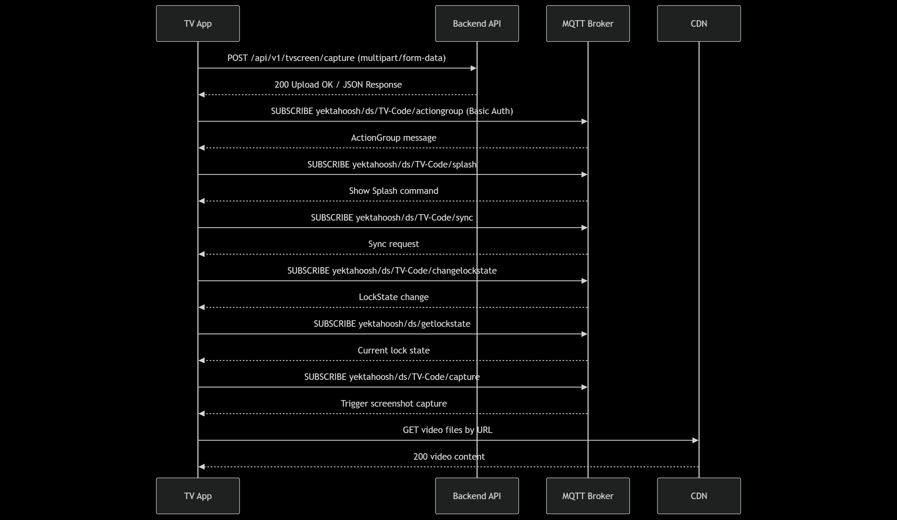

# API Gateway or Routing Design — Digital Signage

## URLs

  - mqtt://mqtt1.yektahoosh.com:6000 (for MQTT req)
  - https://aparatchi.yektahoosh.com/api/v1/tvscreen/capture (for sending screenshot of video)

---

## ثبت دستگاه

   - ابتدا سریال یکتای تولید شده توسط اپلیکیشن نمایش داده میشود و ادمین موظف است آن را در قسمت افزودن تلویزیون پنل ادمین ثبت کند
   - سپس باید به تلویزیون یک اکشن گروپ اختصاص دهد تا دیتا توسط MQTT به تلویزیون سابسکرایب کرده ارسال شود.
   - اپ سریال را در Secure Storage نگه می دارد

---

## MQTT Topic and Message

| Path                         | توضیح کوتاه                         | Message |
-------------------------------|-------------------------------------|-----|
 yektahoosh/ds/TV-Code/actiongroup      | گرفتن اکشن گروپ  | TV-Code |
 yektahoosh/ds/TV-Code/splash           | نمایش اسپلش اسکرین    | - |
 yektahoosh/ds/TV-Code/sync           | سینک شدن TV با سرور | - |
 yektahoosh/ds/TV-Code/changelockstate  | تغییر وضعیت قفل بودن دستگاه  | - |
 yektahoosh/ds/getlockstate            | برگرداندن وضعیت قفل اپلیکیشن| - |
 yektahoosh/ds/TV-Code/capture            | گرفتن اسکرین شات و ارسال به سرور  | - |

در پاسخ های مربوط به ویدیو  لینک دانلود از CDN برگردانده می شود. اپ مستقیم از CDN دانلود می کند.

---

## Routing Design

