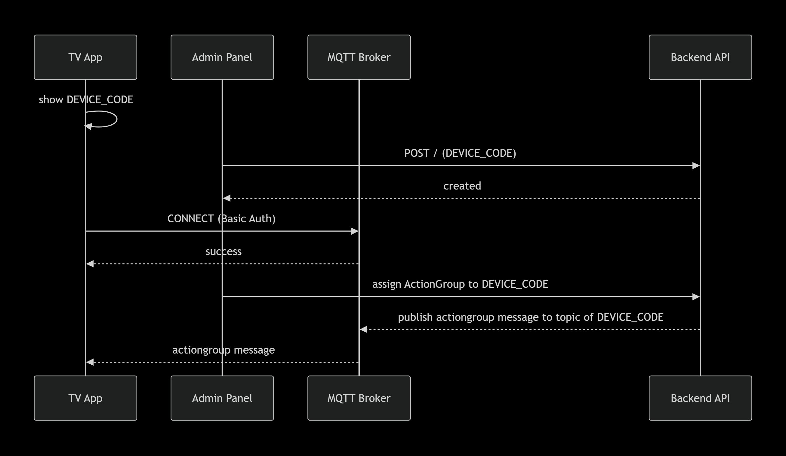

# Authentication / Authorization — Digital Signage

## هدف
این داکیومنت توضیح می‌دهد چه کسی چطور احراز هویت می‌شود و چه چیزی اجازه دارد انجام دهد. تمرکز ما روی دو هویت است: **ادمین پنل** و **دستگاه TV**.

---

## هویت‌ ها
- **Admin (Panel User):** ورود به پنل مدیریت، تعریف TV و اختصاص Action Group.
- **Device (TV App):** اپ Flutter نصب‌شده روی تلویزیون. یک سریال دستگاه دارد و روی MQTT مشترک می‌شود.

---

## سناریو A — ثبت و آماده‌سازی دستگاه 
1) **نمایش سریال در TV:**  
   اپ پس از نصب، یک `TV_CODE` نمایش می‌دهد.

2) **ثبت در پنل توسط ادمین:**  
   ادمین وارد پنل شده، TV جدید را با `TV_CODE` اضافه می‌کند و برای آن یک **Action Group** اختصاص می‌دهد.

3) **تنظیمات MQTT:**  
   - اپ با `Password` و `Usernam` به Broker وصل می‌شود (Basic Auth).  
   - اپ روی تاپیک‌های مخصوص همان دستگاه سابسکرایب میکند:  
     - `yektahoosh/ds/<TV_CODE>/actiongroup`  
     - `yektahoosh/ds/<TV_CODE>/splash`  
     - `yektahoosh/ds/<TV_CODE>/sync`  
     - `yektahoosh/ds/<TV_CODE>/changelockstate`  
     - `yektahoosh/ds/<TV_CODE>/capture`  
     - `yektahoosh/ds/getlockstate`

4) **اعتبارسنجی سمت سرور:**  
   سرور فقط به دستگاه‌ هایی اجازه استفاده می‌دهد که `TV_CODE` آنها در پنل ثبت شده باشد.

---

## سناریو C — ورود ادمین به پنل
- **Panel Login:**   
  - مجوزها: فقط نقش‌های ادمین می‌توانند TV جدید ثبت کنند و Action Group بدهند.

---

## سناریو D — قفل و دسترسی (Lock State)
- تاپیک‌های مرتبط:  
  - `yektahoosh/ds/<DEVICE_CODE>/changelockstate`  
  - `yektahoosh/ds/getlockstate`
- مجوز: فقط پیام‌های صادرشده از پنل معتبرند. دستگاه صرفاً وضعیت قفل را اعمال/گزارش می‌کند.

---

## دیاگرام

### 1) ثبت دستگاه

