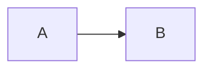

# C1 — System Context (Digital Signage)

## هدف
سیستم Digital Signage برای مدیریت و پخش هماهنگ محتوای ویدیویی روی چند تلویزیون طراحی شده است. ادمین‌ها از طریق **پنل مدیریت** برنامه‌ها و لیست پخش را تعریف می‌کنند و این داده‌ها توسط **سرور مرکزی** منتشر می‌شود. تلویزیون‌ها با اجرای اپلیکیشن Flutter، محتوای دریافتی را دانلود کرده و دقیقاً طبق ساعت سرور به صورت هم‌زمان پخش می‌کنند..  

---

## نقش‌ ها

- ادمین / اپراتور → مسئول زمان‌بندی و لیست ویدیوها  
- بیننده (کاربر نهایی) → فقط خروجی رو روی تلویزیون‌ها مشاهده می کند  

---

## اجزای اصلی
1. **پنل مدیریت (Admin Panel)**  
   - محیط تحت وب برای تنظیم برنامه‌ها و ویدیوها  
   - خروجی به سرور می‌فرسته  

2. **بک‌اند (API + سرور زمان)**  
   - API برای اپ‌ها  
   - ساعت مرجع برای همه دستگاه‌ها  
   - مدیریت احراز هویت و امنیت  

3. **MQTT Broker**  
   - برای پیام‌های فوری (پخش/توقف/رفرش)  
   - تضمین می‌کنه همه TVها هم‌ زمان خبر بگیرن  

4. **CDN / Storage**  
   - محل نگه‌داری ویدیوها  
   - TVها مستقیم فایل‌ها رو دانلود می‌کنن  

5. **اپلیکیشن تلویزیون**  
   - نصب روی Android TV  
   - کش ویدیوها  
   - پخش طبق ساعت سرور  
   - مدیریت Splash و Lock Screen  

---




## ارتباطات سیستم

```mermaid
flowchart LR
  Admin[Admin] -->|مدیریت| Panel[Admin Panel]
  Panel -->|HTTPS| API[(Backend API)]
  API --> Auth[(Auth / Token)]
  API --> CDN[(CDN / Storage)]
  API --> MQTT[(MQTT Broker)]
  API --> Time[(Server Time)]

  TV1[Flutter TV App] -->|Schedule & Actions| API
  TV1 -->|Download Videos| CDN
  TV1 <-->|Real-time Updates| MQTT

  TV2[Another TV] --> API
  TV2 --> CDN
  TV2 <-->|Sync Actions| MQTT```


