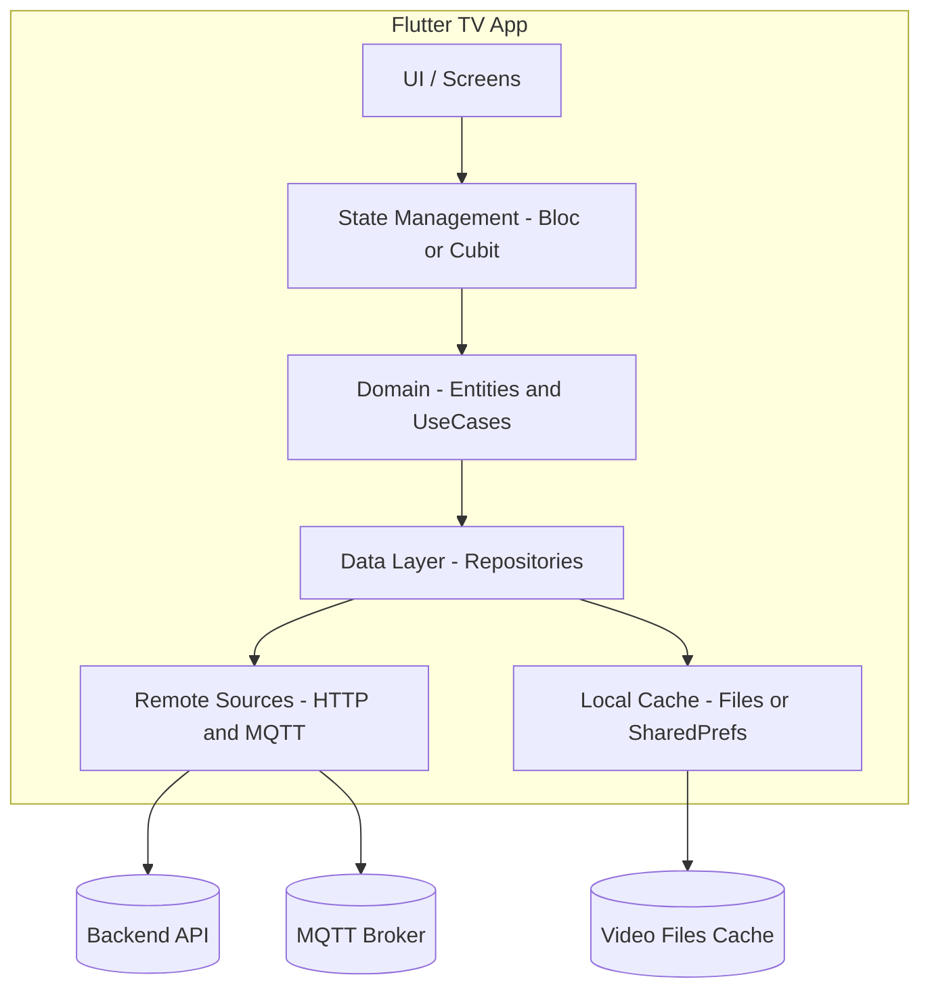

# C2 — Services Dependency Diagram (Signage)

## هدف
نمای کلی از لایه‌های اپ TV (Flutter)، ماژول‌ها/فچرها، پکیج‌های کلیدی، و وابستگی به سرویس‌های بیرونی (API، MQTT، CDN).

---

## لایه‌ها و وابستگی‌ها (High-level)
> جهت فلش یعنی «وابستگی». UI به State وابسته است، State به Domain، Domain به Data، و Data به منابع Remote/Local.

## 🔗 Services Dependency Diagram

