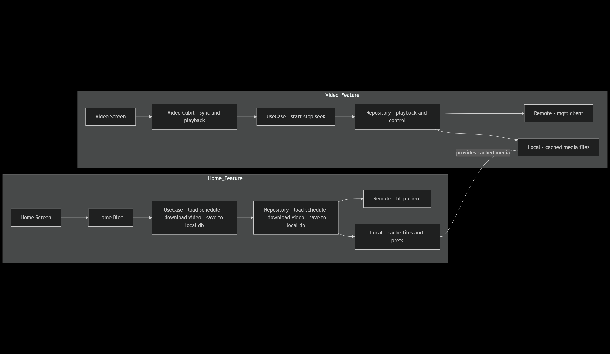

# C3 — Services Architecture Diagram (Signage TV)

## هدف
نمای معماری در سطح سرویس ها: دانلود و کش محتوا، و پخش همزمان بر اساس زمان سرور. 

---

## اجزای اصلی
- Feature Home: Download Manager ،دریافت Schedule   
- Feature Video: کنترل پخش و همگام سازی با زمان سرور
- لایه ها: UI -> State -> Domain -> Data -> Remote/Local
- سرویس های بیرونی: Backend API، MQTT Broker، CDN

---

## Component Map per Feature

