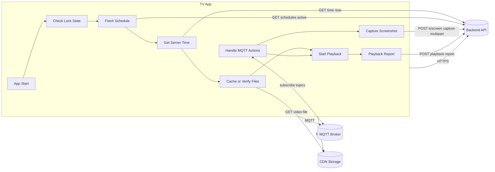

# Data Flow Diagram — Digital Signage (TV App)

## هدف
نمای روندهای اصلی داده در اپ تلویزیون: از راه‌اندازی تا پخش و دستورات لحظه ای.

---

## DFD سطح صفر

```mermaid
flowchart LR
  subgraph TV_App[TV App]
    Start[App Start]
    CheckLock[Check Lock State]
    GetTime[Get Server Time]
    FetchSchedule[Fetch Schedule]
    CacheFiles[Cache or Verify Files]
    Play[Start Playback]
    HandleMqtt[Handle MQTT Actions]
    Capture[Capture Screenshot]
    Report[Playback Report]
  end

  Start --> CheckLock
  CheckLock --> FetchSchedule
  FetchSchedule --> GetTime
  GetTime --> CacheFiles
  CacheFiles --> Play

  HandleMqtt --> Play
  HandleMqtt --> Capture
  Play --> Report

  TV_App -->|HTTPS| API[(Backend API)]
  TV_App -->|MQTT| Broker[(MQTT Broker)]
  TV_App -->|HTTP| CDN[(CDN Storage)]

  GetTime -->|GET time now| API
  FetchSchedule -->|GET schedules active| API
  CacheFiles -->|GET video file| CDN
  HandleMqtt <-->|subscribe topics| Broker
  Capture -->|POST tvscreen capture multipart| API
  Report -->|POST playback report| API
```